# HealthPal
HealthPal — это демонстрационное мобильное приложение для записи к врачам, просмотра медицинских центров и управления профилем.  
Проект создан, чтобы продемонстрировать мои навыки в React Native, включая современный технологический стек, чистый код и продуманный UX. 
Весь проект, включая [API](https://github.com/Artem-Kalugin/healthpal-backend), был разработан исходя только из дизайна в открытом доступе.
## 👀 Превью

    

<a href='https://drive.google.com/file/d/1AJpYqPEn04Ahhp5w_vHBt29_8EY5NpVN/view'>Детальный обзор приложения и основных флоу (~4 мин)</a>
## ⚙ Установка

#### Android
1. Скачать `.apk` файл [здесь](https://drive.google.com/file/d/1JAoW2teKU7mdNtsb_gBzQe2yP4ajTLzi/view?usp=sharing)
2. Установить приложение на устройстве, следуя стандартным инструкциям Android.
> ⚠ Для установки APK из сторонних источников требуется включить соответствующую опцию на устройстве. Убедитесь, что она активирована, иначе установка будет заблокирована.

> ⚠ Размер APK больше, чем у релизной версии в Play Store, так как содержит исходники для всех Android-архитектур. В реальном релизе размер будет в 4 и более раз меньше.

#### iOS
> ⚠ Установка готового билда под iOS недоступна, так как сборка возможна только с платным Apple Developer Account. Разработчики могут собрать приложение самостоятельно по [инструкции](./docs/build.md) при наличии устройства под управлением macOS.
## ⚡ Технологический стек

- **React Native 0.81** — кроссплатформенный фреймворк для iOS и Android.  
- **Expo 54** — обертка над React Native для ускорения разработки + надежные модули для тех или иных задач.  
- **TypeScript** — строгая типизация для надежного кода.  
- **React Navigation** — управление навигацией и роутингом
- **Redux Toolkit + RTK Query** — управление состоянием и работа с API, кэширование ответов сервера.  
- **React Hook Form + class-validator + class-transformer** — валидация форм и DTO.  
- **React Native Reanimated + Gesture Handler** — плавные анимации и жесты.  
- **Expo Location / react-native-yamap** — геолокация и карты (Яндекс Карты).  
- **React Native MMKV + Keychain** — безопасное и быстрое хранение данных и токенов.  

## Реализованные функции

1. **🔐 Регистрация и авторизация пользователей** - полный цикл входа в приложение с восстановлением пароля через OTP-коды
2. **🔍 Поиск врачей** - возможность найти нужного специалиста с фильтрацией и детальной информацией
3. **📅 Запись на приём** - бронирование времени посещения врача через встроенный календарь
4. **🗺️ Интеграция Яндекс.Карт** - визуализация расположения медицинских учреждений с удобной навигацией
5. **⭐ Система избранного** - сохранение любимых врачей и медицинских центров для быстрого доступа
6. **📋 История записей** - просмотр предстоящих и прошлых визитов к врачам
7. **👤 Управление профилем** - редактирование личных данных, загрузка фото профиля и настройка аккаунта
8. **📍 Геолокация ближайших центров** - автоматическое определение и отображение медучреждений с учётом расстояния от пользователя
9. **🎯 Онбординг** - пошаговое знакомство с функционалом приложения для новых пользователей
10. **🏥 Категории специалистов** - удобная навигация по разным направлениям медицины и типам врачей

## 📄 Техническое задание и дизайн

Проект реализован **по открытому дизайн-макету**, доступному по ссылке:  

[👉 Смотреть дизайн в Figma](https://www.figma.com/community/file/1302566707232887096/doctor-appointment-app-ui-kit)

Формального технического задания **не было**.  
Функциональные флоу приложения и пользовательские сценарии разработаны **самостоятельно**,  
на основе личного опыта и общепринятых UX/UI практик для приложений аналогичного типа.  
[API](https://github.com/Artem-Kalugin/healthpal-backend) для проекта так же было разработано самостоятельно и полностью подключено в приложение.

Основная цель — продемонстрировать:
- архитектуру и структуру проекта;
- подход к типизации и масштабированию;
- принципы проектирования UI на основе переиспользуемых компонентов.

## Диаграмма взаимодействия слоев приложения

    

<ul>
<li><a href="./docs/architecture.md">К архитектурным приницпам</a></li>
</ul>

## Диаграмма роутинга в приложении

    

## 📚 Дополнительная документация

<ul>
<li><a href="./docs/build.md">Инструкция к сборке</a></li>
<li><a href="./docs/architecture.md">Архитектура</a></li>
<li><a href="./docs/why-no-cd.md">Почему нет CD</a></li>
<li><a href="./docs/why-no-push.md">Почему нет пушей</a></li>
<li><a href="./docs/why-no-tests.md">Почему нет тестов</a></li>
<li><a href="./docs/why-not-bare.md">Почему Expo, а не Bare React Native</a></li>
</ul>
